# ✅ CI/CD Setup Verification

## Current Status: **READY TO GO** 🚀

Your GitHub Actions workflow is **already committed and pushed** to your repository. The CI/CD pipeline will automatically trigger on the following events:

---

## 📋 What's Already Set Up

### 1. ✅ Workflow File Location
```
.github/workflows/ci-cd.yml
```
- **Status**: ✅ Committed to Git
- **Last Updated**: Commit `6333cd2` - "workflow doc"
- **Pushed to**: `origin/main`

### 2. ✅ Automatic Triggers

Your CI/CD pipeline will **automatically run** when:

#### Push Events:
```yaml
on:
  push:
    branches: [ main, develop ]
```
- ✅ Any push to `main` branch
- ✅ Any push to `develop` branch

#### Pull Request Events:
```yaml
  pull_request:
    branches: [ main ]
```
- ✅ Any PR targeting `main` branch

---

## 🔄 CI/CD Pipeline Jobs

### Job 1: Lint & Test
**Triggers**: On every push/PR
- ✅ Setup PHP 8.3
- ✅ Install Composer dependencies
- ✅ Run Laravel Pint (code style)
- ✅ Run PHPUnit tests

### Job 2: Security Scan
**Triggers**: After Lint & Test passes
- ✅ Build Docker image
- ✅ Run Trivy vulnerability scanner
- ✅ Upload results to GitHub Security

### Job 3: Build & Push
**Triggers**: Only on push to `main` branch
- ✅ Build production Docker image
- ✅ Push to GitHub Container Registry (GHCR)
- ✅ Tag with: `latest`, `main-<sha>`, `main`

### Job 4: Deploy (Bonus)
**Triggers**: Only on push to `main` branch (after Build & Push)
- ✅ SSH to VPS
- ✅ Pull latest images
- ✅ Run migrations
- ✅ Cache configuration

---

## 🧪 How to Test Your CI/CD

### Option 1: Make a Small Change
```bash
# Make any change to trigger the workflow
echo "# Test CI/CD" >> README.md
git add README.md
git commit -m "test: trigger CI/CD pipeline"
git push origin main
```

### Option 2: Create a Pull Request
```bash
# Create a feature branch
git checkout -b feature/test-cicd
echo "# Testing" >> test.txt
git add test.txt
git commit -m "test: CI/CD on PR"
git push origin feature/test-cicd

# Then create a PR on GitHub targeting main
```

### Option 3: Manual Trigger (if enabled)
Go to GitHub → Actions → Select workflow → Run workflow

---

## 📊 Monitoring Your CI/CD

### View Workflow Runs:
1. Go to your GitHub repository
2. Click on **"Actions"** tab
3. You'll see all workflow runs with status:
   - ✅ Green checkmark = Success
   - ❌ Red X = Failed
   - 🟡 Yellow dot = In progress

### View Logs:
1. Click on any workflow run
2. Click on individual jobs to see detailed logs
3. Expand steps to see command output

---

## 🔐 Required GitHub Secrets (for Deployment)

To enable the **Deploy** job, add these secrets in GitHub:

### Navigate to:
`Repository → Settings → Secrets and variables → Actions → New repository secret`

### Add These Secrets:
```
VPS_HOST          = your.vps.ip.address
VPS_USERNAME      = root (or your SSH user)
VPS_SSH_KEY       = <paste your private SSH key>
```

**Note**: Until these secrets are added, the Deploy job will fail (but other jobs will still run).

---

## 🎯 What Happens on Each Push to Main

```mermaid
graph LR
    A[Push to main] --> B[Lint & Test]
    B --> C[Security Scan]
    C --> D[Build & Push to GHCR]
    D --> E[Deploy to VPS]
    E --> F[Live! 🎉]
```



1. **Lint & Test** (~2-3 min)
   - Code style check
   - Run all tests

2. **Security Scan** (~3-5 min)
   - Build Docker image
   - Scan for vulnerabilities

3. **Build & Push** (~5-7 min)
   - Build production image
   - Push to GitHub Container Registry

4. **Deploy** (~2-3 min)
   - SSH to VPS
   - Pull and restart containers
   - Run migrations

**Total Time**: ~12-18 minutes from push to live

---

## ✅ Verification Checklist

- [x] Workflow file exists at `.github/workflows/ci-cd.yml`
- [x] Workflow file is committed to Git
- [x] Workflow file is pushed to `origin/main`
- [x] Triggers configured for push and PR events
- [x] All 4 jobs defined (Lint, Security, Build, Deploy)
- [x] Docker multi-stage build configured
- [x] GitHub Container Registry integration
- [ ] VPS secrets added (optional, for deployment)

---

## 🚨 Common Issues & Solutions

### Issue 1: Workflow Not Running
**Solution**: Check that:
- File is in `.github/workflows/` directory
- File has `.yml` or `.yaml` extension
- File is committed and pushed to GitHub
- Branch name matches trigger configuration

### Issue 2: Tests Failing
**Solution**: Run tests locally first:
```bash
docker-compose exec app php artisan test
```

### Issue 3: Docker Build Failing
**Solution**: Test build locally:
```bash
docker build -t secure-drop:test .
```

### Issue 4: Deploy Job Failing
**Solution**: 
- Verify VPS secrets are added
- Test SSH connection manually
- Check VPS has Docker installed

---

## 🎉 You're All Set!

Your CI/CD pipeline is **fully configured and ready**. Every time you push to `main` or `develop`, or create a PR, GitHub Actions will automatically:

1. ✅ Check your code style
2. ✅ Run all tests
3. ✅ Scan for security vulnerabilities
4. ✅ Build and push Docker images
5. ✅ Deploy to your VPS (when secrets are configured)

**Next Step**: Make a commit and watch the magic happen! 🚀

---

## 📚 Additional Resources

- [GitHub Actions Documentation](https://docs.github.com/en/actions)
- [Docker Build Push Action](https://github.com/docker/build-push-action)
- [Trivy Security Scanner](https://github.com/aquasecurity/trivy)
- [SSH Action for Deployment](https://github.com/appleboy/ssh-action)

---

**Last Verified**: February 9, 2026
**Status**: ✅ Production Ready
